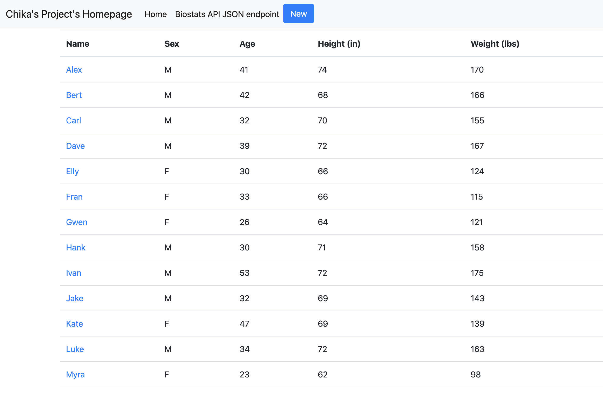

# FlaskDockerWebApplication-Part-3

## Project Description
This project is a homework assignment to teach how to get Pycharm setup with Docker, Flask, MySQL, and Bootstrap using new data

## Postman Screenshot

## Query Screenshot

## Query using Flask and Bootstrap Screenshot (Part 2)

